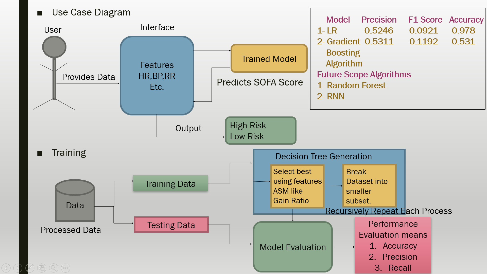

# SIH2020
<h1 align="center">
   
   
   
</h1>

 

  This repository contains the <strong>Sepsis Detection project(ABHIGYATA)</strong> source code.
  Abhigayata is web solution made for the early dection of SEPSIS.It is the project TEAM - HEISENBUGS have done for SIH2020(Smart India Hackathon).

# Overview
1. The goal of this Challenge is the early detection of sepsis using physiological data. 
2. Develop a digital solution that uses artificial intelligence to detect patient deterioration before it’s too late and trigger notifications to clinicians and care teams. 
3. Train healthcare providers and front-line staff to quickly recognize symptoms to identify sepsis and treat patients at the earliest. 
4. Educate preventing infections in health care settings and in the community so that infections that can lead to sepsis can be stopped before they happen. 
5. Provide guidelines to follow infection control requirements (e.g., Hand hygiene) and ensure one to receive recommended vaccines

## Table of contents

  * [Introduction](#overview)
  * [Symptoms](#overview)
  * [Causes](#causes)
  * [Effects](#effects)
  * [TaskToDo](#TaskToDo)
    - [] Awareness
    - [] Detection
    - [] Notification
    - [] Documentation
  
### Detail
  * [Awareness](#awareness)
     * [gif](#gif)
     * [why awareness](#awareness)
     * [TechnologyUsed](#TechnologyUsed)
  * [Detection](#detection)
     * [Approach](#approach)
     * [flowchart](#flowchart)
     * [graphs](#graph)
     * [TechnologyUsed](#TechnologyUsed)
  * [Notification](#awareness)
     * [flowchart](#flowchart)
     * [TechnologyUsed](#TechnologyUsed)
  * [Documentation](#Documentation)
  * [FutureScope](#futurescope)
  * [Contributing](#contributing)
  * [References](#references)
  * [License](#license)
  * [Special thanks](#special-thanks)

### Introduction
According to World Health Organisation (WHO) , “Sepsis is a potentially life-threatening organ dysfunction caused by a dysregulated host response to infection. Any type of infectious pathogen can potentially cause sepsis.”
### Symptoms
#### General Symptoms
1. A fever above 101ºF (38ºC) or a temperature below 96.8ºF (36ºC)
2. Heart rate higher than 90 beats per minute
3. Breathing rate higher than 20 breaths per minute
4. Probable or confirmed infection
### Causes
Know more on our website
### Effects
Know more on our website
### Awareness
As Awareness is a very important aspect for preventing the spread of any disease.We aim to spread  awareness in two ways:
1. Through a Website
2. Through a Telegram Bot
#### website
***

To get more details about SEPSIS visit our website <a href="https://developer.apple.com/swift/blog/?id=35">ABHIGYATA</a> 
***
#### Features of website
1. Covers all the important aspects regarding <strong>Prevention and Symptoms</strong>
2. <strong>ML prediction Model</strong> is integrated with it that will do the task of early Detection of SEPSIS using the SOFA Score.
3. Training Module for the employee of the Health care institutions.

#### Technology USED
HTML5,CSS,BOOTSRAP4,JAVASCRIPT,JQUERY,PYTHON in combination with FLASK 

#### Telegram Bot
***

To get more details about SEPSIS visit our Telegram Bot <a href="https://developer.apple.com/swift/blog/?id=35">@sepsissupport</a> 
***
#### Why Telegram BOT?
1. A <strong>Telegram Chatbot</strong>will be included as tool to spread Awareness.
2. Real-Time Assistance along with Better Interaction will be provided once the chatbot gets trained enough.
3. More people can be handled 24/7 service will be provided and only necessary queries will be forwarded to a real person.

#### Technology USED
Python,PHP,Telegram API

### Detection
This is how our System Works.

#### flowcharts

### Notification
1. Our website provide a notification section to express alerts if the prediction for sepsis label is found positive.
2. a Separate user-interface will be designed using python library for triggering Alerts to the Hospital Staff.
### Documentation
1. We created a well docomented code with stepwise pathway for easy understanding.
2. PPT for the Presentation of the Idea.
### Future Scope
1. More efficient Algorithms can be used for prediction of SEPSIS.
### Contributing
<table>

</table>
<a href="https://github.com/Vish1811">Vishnu Kumar</a> 
<a href="https://github.com/sonuverma1">Sonu Verma</a> 
<a href="https://github.com/shre-ya">Aditi Shreya</a> 
<a href="https://github.com/Piyush490">Piyush Agarwal</a> 
<a href="https://github.com/niimmii">Namrata Gupta</a> 
<a href="https://github.com/aanchal269">Aanchal Singh</a> 

> **Disclaimer**: All arrays mentioned in this section must exist for the examples to work.

### References
1. https://www.physionet.org/content/challenge-2019/1.0.0/
2. https://www.datacamp.com/community/tutorials/decision-tree-classification-python
3. https://towardsdatascience.com/using-bagging-and-boosting-to-improve-classification-tree-accuracy-6d3bb6c95e5b
4. https://towardsdatascience.com/early-detection-of-sepsis-using-physiological-data-78d5f31fab9d
5. https://iopscience.iop.org/article/10.1088/1757-899X/428/1/012004
### License
### Special Thanks
To our Seniors who provided us guidance at necesscary point of time.

