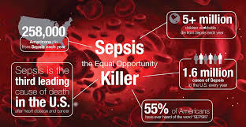

# SIH2020
<h1 align="center">
   
   
   
</h1>

 

  This repository contains the <strong>Sepsis Detection project(ABHIGYATA)</strong> source code.
  Abhigayata is web solution made for the early dection of SEPSIS.It is the project TEAM - HEISENBUGS have done for SIH2020(Smart India Hackathon).

# Overview
1. The goal of this Challenge is the early detection of sepsis using physiological data. 
2. Develop a digital solution that uses artificial intelligence to detect patient deterioration before it’s too late and trigger notifications to clinicians and care teams. 
3. Train healthcare providers and front-line staff to quickly recognize symptoms to identify sepsis and treat patients at the earliest. 
4. Educate preventing infections in health care settings and in the community so that infections that can lead to sepsis can be stopped before they happen. 
5. Provide guidelines to follow infection control requirements (e.g., Hand hygiene) and ensure one to receive recommended vaccines

## Table of contents

  * [Introduction](#overview)
  * [Symptoms](#overview)
  * [Causes](#causes)
  * [Effects](#effects)
  * [Task to do](#task to do)
    * [Awareness](#awareness)
    * [Detection](#detection)
    * [Notification](#notification)
    * [Docomentation](#ppt)
### Detail
  * [Awareness](#awareness)
     * [gif](#gif)
     * [why awareness](#awareness)
     * [TechnologyUsed](#technology used)
  * [Detection](#detection)
     * [Approach](#approach)
     * [flowchart](#flowchart)
     * [graphs](#graph)
     * [TechnologyUsed](#technology used)
  * [Notification](#awareness)
     * [flowchart](#flowchart)
     * [TechnologyUsed](#technology used)
  * [FutureScope](#futurescope)
  * [Contributing](#contributing)
  * [References](#references)
  * [License](#license)
  * [Special thanks](#special-thanks)